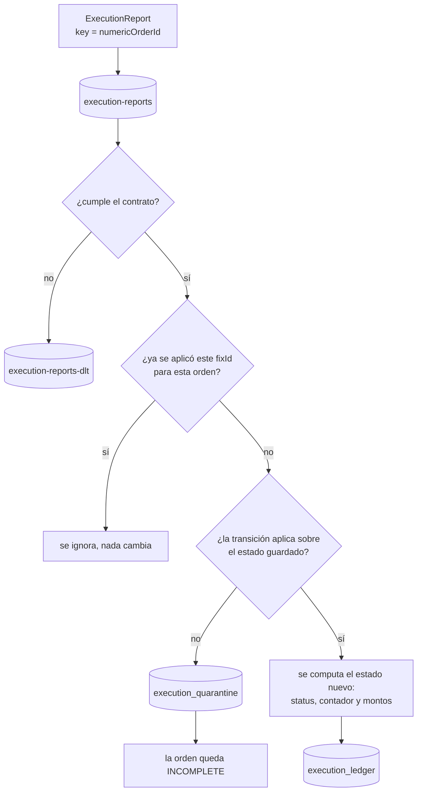
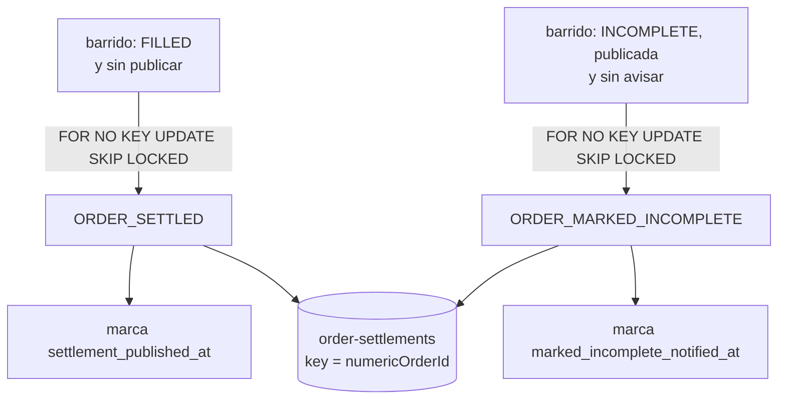
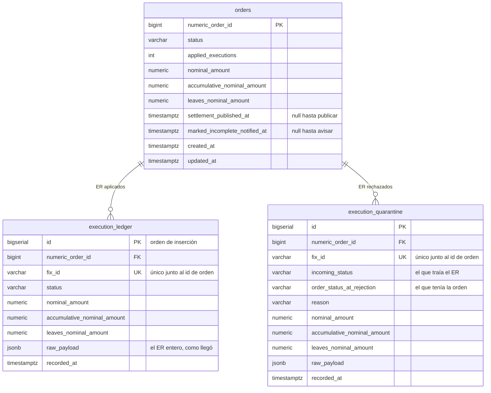

# Order State Service - Max Capital Challenge

Servicio que consume `ExecutionReport` de forma asíncrona y mantiene el estado de cada orden
correcto bajo carga, reentregas y fallas, corriendo en dos instancias en paralelo.

El razonamiento detrás del diseño está en [`DECISIONS.md`](./DECISIONS.md): qué garantiza cada
componente, qué no garantiza, y qué se resignó a conciencia.

## Qué hace

- Consume ER de Kafka con `numericOrderId` como key: todos los ER de una orden caen en la misma
  partición y los aplica un solo consumidor por vez.
- Computa el estado nuevo sobre el persistido; nunca sobreescribe con el último ER.
- Deduplica por `(numericOrderId, fixId)` con una restricción única en PostgreSQL.
- Un ER que no se puede aplicar se preserva en cuarentena y la orden queda `INCOMPLETE`.
- Un ER que rompe el contrato va a un dead-letter topic; el consumidor sigue.
- Al completarse una orden publica un `settlement` a un topic downstream, y si después algo la
  contradice publica un aviso.
- Todo se consulta por HTTP: estado, ledger, cuarentena y qué se le informó a downstream.

## Cómo funciona

Un ER entra por Kafka y termina en uno de tres lugares. La key del mensaje es el `numericOrderId`,
así que todos los ER de una orden caen en la misma partición y los aplica un solo consumidor por vez.



La publicación a downstream **no viaja en esa transacción**. Son dos barridos independientes, con su
propio pool de hilos, que miran la base cada segundo:



El lock es lo que hace que, con las dos instancias barriendo a la vez, cada orden la publique una
sola. La marca se escribe **después** de que el broker confirma, así que una caída en el medio
cuesta una republicación, nunca un settlement perdido.

## El modelo de datos



El único de `execution_ledger` es la barrera de idempotencia: **una entrada por ER efectivamente
aplicado**, y el intento repetido choca contra la restricción en vez de contra una comprobación en
memoria. Tiene una gemela en cuarentena, para que un ER rechazado tampoco se duplique.

`raw_payload` guarda el mensaje entero aunque el modelo sólo use seis campos: una tabla de auditoría
que guarda menos de lo que llegó no sirve para reconstruir nada.

## Requisitos

- **Java 21.** El enunciado admite Java 21 o 25; se eligió 21 por ser el LTS con el soporte más
  maduro en Spring Boot, Testcontainers y drivers. El build **falla explícitamente** con otro JDK:
  la restricción del enunciado es una condición del build, no una nota al pie.
- Docker y Docker Compose.
- Maven no hace falta: el repositorio incluye el wrapper (`./mvnw`).

En macOS con Homebrew, `openjdk@21` es keg-only y convive con otros JDK:

```bash
export JAVA_HOME=/opt/homebrew/opt/openjdk@21/libexec/openjdk.jdk/Contents/Home
```

## Levantar todo

```bash
docker compose up -d --build
```

Levanta PostgreSQL (`5433`), Kafka (`19092`) y **dos instancias del servicio**, en `8081` y `8082`.
Las dos comparten el mismo consumer group.

Los servicios de aplicación no declaran healthcheck, así que `up -d` vuelve antes de que estén
listos. La primera vez compila el proyecto dentro de la imagen, así que tarda unos minutos; con las
imágenes ya construidas, unos quince segundos. Esperá a ver:

```bash
docker compose logs -f app-1 | grep "Started OrderStateServiceApplication"
```

**Si algún puerto estaba ocupado.** Docker levanta el resto de la stack igual y deja el contenedor
que no pudo bindear **sin red**. Al reintentar, ese contenedor falla diciendo que no puede conectarse
a la base, que no tiene nada que ver con la causa. Liberá el puerto y recreá:

```bash
docker compose up -d --force-recreate
```

Para bajar todo y borrar los datos:

```bash
docker compose down -v
```

## El recorrido completo

Todo lo de abajo está verificado; los comandos se copian tal cual.

**Arrancá de cero.** El recorrido usa ids fijos, así que con datos de una corrida anterior el paso 1
devuelve otra cosa:

```bash
docker compose down -v && docker compose up -d --build
```

Y conviene tener abierto:

```bash
docker compose logs -f app-1 app-2
```

Ese comando busca el `docker-compose.yml` en el directorio actual. Si lo corrés desde una segunda
terminal, que abre en `~`, usá la forma que no depende de dónde estés parado:

```bash
docker compose -p max-capital-challenge logs -f app-1 app-2
```

Un ER necesita seis campos: `fixId`, `numericOrderId`, `status` y los tres montos. El resto del
mensaje real se conserva entero en `rawPayload` aunque no esté modelado.

### 1. Un ER entra y crea la orden

La key del mensaje es el `numericOrderId`: es lo que hace que todos los ER de una orden caigan en la
misma partición.

```bash
echo '700001:{"fixId":"FIX-0001","numericOrderId":700001,"status":"NEW","nominalAmounts":4956,"accumulativeNominalAmount":0,"leavesNominalAmount":4956}' \
  | docker exec -i maxcapital-kafka /opt/kafka/bin/kafka-console-producer.sh \
      --bootstrap-server localhost:9092 --topic execution-reports \
      --property parse.key=true --property key.separator=:
```

```bash
curl -s http://localhost:8081/orders/700001
```

Devuelve `status: NEW`, `appliedExecutions: 1` y el ledger con una entrada. Una orden inexistente
devuelve `404` con `ORDER_NOT_FOUND`.

Consultá la misma orden en `8082`: las dos instancias comparten la base, así que da lo mismo.

### 2. El mismo ER otra vez no se aplica dos veces

Publicá **exactamente el mismo mensaje**. En el log:

```
duplicate ignored numericOrderId=700001 fixId=FIX-0001 partition=3 offset=1
```

`appliedExecutions` sigue en 1 y el ledger sigue con una entrada. La barrera es la restricción única,
no una comprobación previa en memoria:

```bash
docker exec maxcapital-postgres psql -U orderstate -d orderstate -c "\d execution_ledger"
```

### 3. La orden se completa y sale el settlement

```bash
echo '700001:{"fixId":"FIX-0002","numericOrderId":700001,"status":"FILLED","nominalAmounts":4956,"accumulativeNominalAmount":4956,"leavesNominalAmount":0}' \
  | docker exec -i maxcapital-kafka /opt/kafka/bin/kafka-console-producer.sh \
      --bootstrap-server localhost:9092 --topic execution-reports \
      --property parse.key=true --property key.separator=:
```

Un barrido publica el settlement al segundo siguiente, sin que nadie lo invoque:

```bash
docker exec maxcapital-kafka /opt/kafka/bin/kafka-console-consumer.sh \
  --bootstrap-server localhost:9092 --topic order-settlements \
  --from-beginning --timeout-ms 4000
```

```
{"type":"ORDER_SETTLED","numericOrderId":700001}
```

Un solo mensaje, aunque las dos instancias barren cada segundo.

### 4. Un ER que llega tarde congela la orden y avisa

```bash
echo '700001:{"fixId":"FIX-0003","numericOrderId":700001,"status":"PARTIALLY_FILLED","nominalAmounts":4956,"accumulativeNominalAmount":2000,"leavesNominalAmount":2956}' \
  | docker exec -i maxcapital-kafka /opt/kafka/bin/kafka-console-producer.sh \
      --bootstrap-server localhost:9092 --topic execution-reports \
      --property parse.key=true --property key.separator=:
```

No se aplica sobre una orden ya terminal: se preserva en cuarentena y la orden pasa a `INCOMPLETE`.
Como ya se le había informado el completado a downstream, sale un segundo mensaje:

```
{"type":"ORDER_SETTLED","numericOrderId":700001}
{"type":"ORDER_MARKED_INCOMPLETE","numericOrderId":700001}
```

En ese orden, garantizado por ir al mismo topic con la misma key.

```bash
curl -s http://localhost:8081/orders/700001
```

Ahora muestra `status: INCOMPLETE`, el ER rechazado en `quarantine` con el estado que tenía la orden
al rechazarlo, y las dos marcas de lo que se le informó a downstream:

```
"status": "INCOMPLETE", "appliedExecutions": 2,
"settlementPublishedAt": "...", "markedIncompleteNotifiedAt": "..."
```

### 5. Un ER que rompe el contrato no bloquea el flujo

```bash
echo '700002:{"fixId":"FIX-BAD","numericOrderId":700002,"status":"BOGUS","nominalAmounts":4956,"accumulativeNominalAmount":0,"leavesNominalAmount":4956}' \
  | docker exec -i maxcapital-kafka /opt/kafka/bin/kafka-console-producer.sh \
      --bootstrap-server localhost:9092 --topic execution-reports \
      --property parse.key=true --property key.separator=:
```

`BOGUS` no es un estado del contrato. El ER no se persiste, se preserva entero en el dead-letter
topic, y el consumidor sigue procesando lo que venga detrás:

```bash
docker exec maxcapital-kafka /opt/kafka/bin/kafka-console-consumer.sh \
  --bootstrap-server localhost:9092 --topic execution-reports-dlt \
  --from-beginning --timeout-ms 4000
```

`curl http://localhost:8081/orders/700002` devuelve `404`: no se creó nada.

## Ver la evidencia en los tres lugares

Los tres números cuentan la misma historia desde sistemas distintos.

**Hasta dónde llegó cada instancia y cuánto le falta:**

```bash
docker exec maxcapital-kafka /opt/kafka/bin/kafka-consumer-groups.sh \
  --bootstrap-server localhost:9092 --describe --group order-state-service
```

Con `--members` se ve el reparto de particiones entre las dos instancias.

**Los mensajes siguen en el log, consumidos y todo:**

```bash
docker exec maxcapital-kafka /opt/kafka/bin/kafka-console-consumer.sh \
  --bootstrap-server localhost:9092 --topic execution-reports \
  --from-beginning --timeout-ms 4000 --property print.key=true --property print.partition=true
```

**Y lo que realmente se aplicó:**

```bash
docker exec maxcapital-postgres psql -U orderstate -d orderstate \
  -c "SELECT numeric_order_id, status, applied_executions, settlement_published_at FROM orders ORDER BY numeric_order_id;" \
  -c "SELECT id, numeric_order_id, fix_id, status FROM execution_ledger ORDER BY id;" \
  -c "SELECT numeric_order_id, fix_id, order_status_at_rejection, reason FROM execution_quarantine;"
```

El contador de la orden y la cantidad de filas del ledger tienen que coincidir siempre.

## Tests

```bash
./mvnw clean verify
```

96 tests, con PostgreSQL y Kafka reales vía Testcontainers. Cubren el ciclo de vida, la
deduplicación, la máquina de estados, la política de errores, la coerción del contrato y el
settlement con sus casos de falla.

```bash
./mvnw test-compile org.pitest:pitest-maven:mutationCoverage
```

Mutation testing. La pregunta que responde no es *cuánto código tocan los tests*, sino **si los
tests detectan un cambio de comportamiento**: PIT altera el bytecode y verifica que algún test
falle. Un mutante que sobrevive es una línea que se puede romper sin que ninguna prueba se entere.
El reporte queda en `target/pit-reports/`.

### Por qué el barrido devuelve cuántas publicó

En producción nadie usa ese número: los barridos los llama un `@Scheduled` que descarta el
resultado. Está porque sin él **el loop del barrido es invisible**.

El barrido publica de a una y sigue mientras haya pendientes. Si esa condición se rompe —siempre
`true`, y da cien vueltas contra una consulta vacía; siempre `false`, y publica una sola por
pasada— **los mensajes que le llegan a downstream son exactamente los mismos**. Ningún test que
mire el topic se entera.

Lo detectó el mutation testing: la clase del publicador estaba en 57%, y los sobrevivientes eran
todos ese booleano. Devolviendo el contador y afirmándolo en los tests —uno o más en el primer
barrido, cero en el segundo— pasó a 91%. El número existe para que la prueba pueda ver lo que el
topic no muestra.

## Puertos y variables

| | |
|---|---|
| `app-1` | `http://localhost:8081` |
| `app-2` | `http://localhost:8082` |
| PostgreSQL | `5433` |
| Kafka | `19092` |

| Variable | Default | Para qué |
|---|---|---|
| `APP_INSTANCE_ID` | `local` | Identifica la instancia en cada línea de log |
| `ER_TOPIC` | `execution-reports` | Topic de entrada |
| `ER_DLT` | `execution-reports-dlt` | Dead-letter topic |
| `SETTLEMENT_TOPIC` | `order-settlements` | Topic de settlement y avisos |
| `ER_PARTITIONS` | `4` | Fija durante el ejercicio: cambiarla remapea claves |
| `ER_RETRY_MAX_ATTEMPTS` | `3` | Reintentos ante una falla transitoria |
| `SETTLEMENT_SWEEP_INTERVAL` | `1s` | Cada cuánto se busca qué publicar |

El servicio **no arranca** si el peor caso de reintentos no entra en un `max.poll.interval.ms`. Es
deliberado: la garantía vive en el código y no en un comentario.

## Escenarios preparados

[`docs/DEMO.md`](./docs/DEMO.md) tiene escenarios listos para correr con `scripts/demo.sh`, entre
ellos la caída de una instancia a mitad de procesamiento, que es más incómoda de armar a mano que
los cinco pasos de arriba.

## Sobre el proceso

Las decisiones de diseño de este repositorio se trabajaron usando un modelo de lenguaje como
*sparring*: para cuestionar alternativas, forzar escenarios de falla concretos y contrastar
afirmaciones contra la documentación oficial de cada tecnología. Los commits llevan el trailer
`Co-Authored-By` correspondiente.

El razonamiento y los trade-offs registrados en [`DECISIONS.md`](./DECISIONS.md) son propios y
defendibles uno por uno, incluyendo qué garantiza cada componente, qué no garantiza, y qué se
resignó a conciencia.
